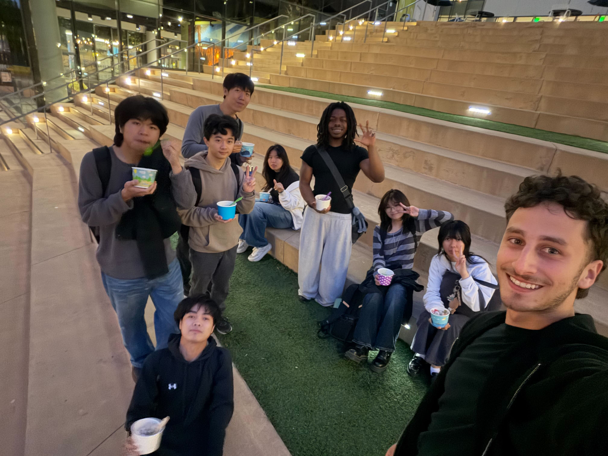

# Team 3 Meeting Minutes

**Type of Meeting:** Final Project Overview Planning  
**Date/Time:** April 30th, 2026  
**Location/Method:** In-person, CSE Basement Lab   

**Members Present:** Ori, Angel, Scottin, Ryan, David, Humza, Katie, Tianlin, Nathan, Ike, Nat  

## Agenda
- Review expectations for the CSE 110 final project
- Discuss weekly time commitment and team communication expectations
- Begin planning the first sprint for the Agent Issue Tracker project
- Identify research areas and planning tasks due by the next meeting

## New Business
The team reviewed the expectations for the final project and discussed the importance of prioritizing the team’s process over only focusing on the final product. Since the project is open-ended, the team will need to clearly document planning, research, decisions, and sprint progress throughout the remainder of the quarter.

The expected weekly time commitment is around **8-10 hours per week**, but this is not a strict requirement. Team members should communicate clearly if they are busy, blocked, or unable to complete work for a given week.

The team also discussed the structure of future meetings and sprint communication. They may use a stand-up bot will ask each person for progress updates, and the team will have a weekly meetup time. The team is also expected to complete a sprint review and retrospective twice during the remainder of the quarter, with one before the team swap and one after.

During **Week 9**, the team will participate in a team swap where they will review another team’s product and receive feedback on their own.

This week’s sprint is mainly focused on **research and project planning**. Team members should try to document their research in Angel’s planning document: [Angel's planning document](https://docs.google.com/document/d/1qTym5jxQ53jNcsUGkz5WMzQzFckJrqxmyvpIZLIAOX8/edit?usp=sharing).

## Research Topics
- API calls to AI
- Jira, Linear, and GitHub Issues
- Existing issue tracker workflows
- AI-assisted issue tracking and agent-readable task formats
- Ways to track tokens, budget, and time within an AI workflow

## Tasks Due by Next Meeting \(Week 6\)
- Research and planning
  - Build background knowledge on issue trackers and AI workflows
  - Begin defining user stories and personas
  - Begin planning the features the team wants to include
- Create a document describing what the app should accomplish
  - This document may later be posted to the GitHub repository
- Plan the scope of future sprints

## Notes
- Process is more important than the final product for this project.
- The team should avoid jumping into heavy coding too early.
- Planning, research, and shared understanding should come before implementation.
- Everyone should contribute to research and document what they find.
- Future sprint work should be scoped realistically based on team availability.

## Group Photo

