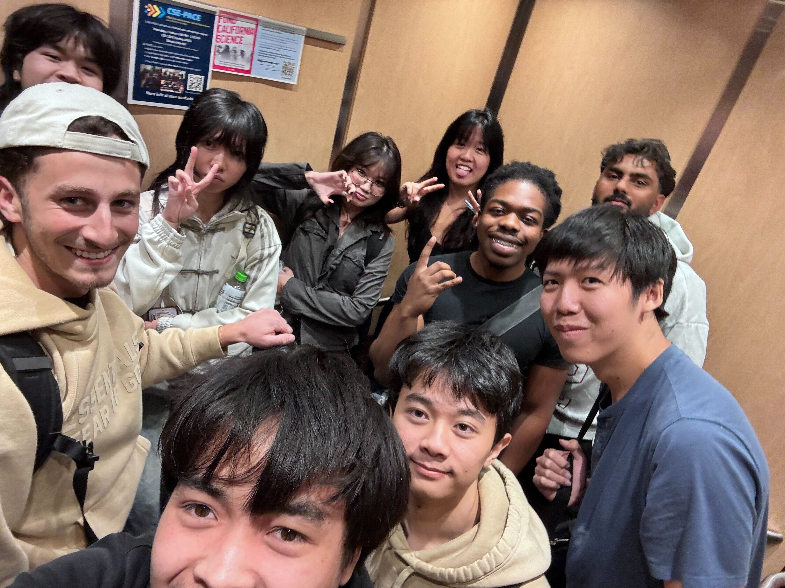

# Team 3 Meeting Minutes

**Type of Meeting:** Final Project Prototype Planning  
**Date/Time:** May 5th, 2026, 6:30 PM - 8:00 PM  
**Location/Method:** In-person, CSE Basement Lab   

**Members Present:** Ori, Angel, Scottin, Ryan, David, Humza, Katie, Tianlin, Nathan, Ike, Nat  
**Members Left Early:** Tianlin

## Agenda
- Share research findings for the Agent Issue Tracker project
- Discuss project scope
- Set expectations for the next stand-up 

## New Business
The team met in person to continue planning the **Agent Issue Tracker** final project.

Each person went over their research and findings from the previous week. The team discussed existing issue tracker tools and workflows, including how tools like YouTrack, Breads, and Zoho Bug Tracker handle issue organization, tags, statuses, dependencies, and automation.

The team also discussed the main direction of the project. The tracker should function as a simple issue tracker designed for AI agents rather than being overly complex for human users. Because of this, the team wants to focus on clear, structured issue information that an agent can easily read and act on.

The team discussed possible features they may want to include, such as token tracking, issue tagging, blockers, bug/feature/documentation issue types, a reference directory, and simple priority labels. The team also discussed having persistent memory for agents and including issue metadata such as status tags, type tags, titles, bodies, relevant files/directories, scope limits, blockers, dependencies, and relationships between issues.

The team reviewed a general issue template based on the whiteboard notes and discussed how it could help keep issues structured and readable for agents.

During the meeting, the team split into two groups to prototype two possible versions of the Agent Issue Tracker:
- A VS Code-based version
- A CLI-based version

Both prototype groups are expected to have their prototypes completed by Saturday or Sunday. The team also planned to have a stand-up meeting tomorrow at 9:00 AM. This stand-up will not be on Zoom.

## Tasks Due by Next Meeting
- Complete early prototypes by Saturday or Sunday
  - VS Code prototype group
  - CLI prototype group
- Compare the VS Code and CLI prototype directions
- Decide which prototype direction seems more realistic for the team’s scope
- Define an MVP before end of Sunday

## Group Photo

