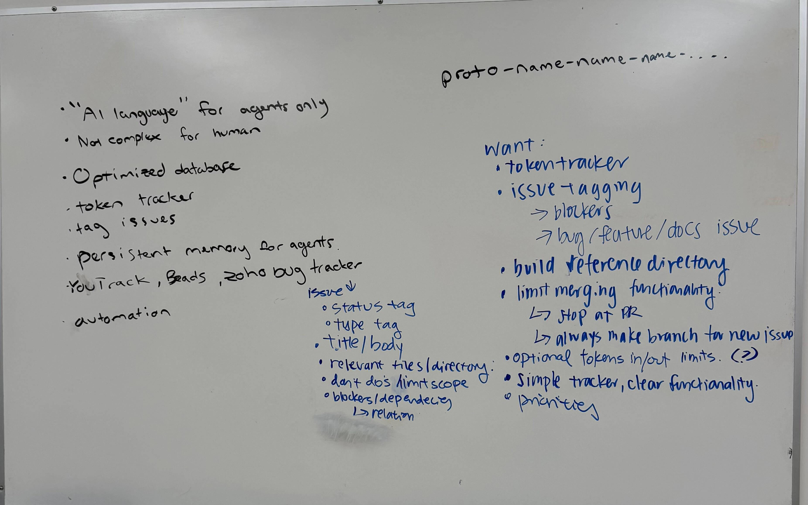

# Sprint 1 Plan

**Sprint Duration:** May 3, 2026 - May 10, 2026

## Sprint Goal

Review team research, split into 2 prototype development teams to test CLI vs VSCode extension as final deliverable format. Practice collaborative devleopment. Set up main repository for actual product start. 

## Planned Deliverables

* [X] VSCode Extension prototype 
* [X] CLI + WebUI prototype

## Related Issues / Deliverables

[VSCode Extension Prototype Repository](https://github.com/cse110-sp26-group03/proto-ori-nathan-scott-katie-nat)

[CLI + WebUI Prototype Repository](https://github.com/cse110-sp26-group03/proto-ike-humza-ryan-david-tian)

## Risks / Concerns

* Not sure what team strengths are, sort of arbitrarily split them into groups 
* Nobody is super familar with group work, worried about how to work as a team

## Post Sprint Notes

The CLI prototype created a working prototype largely using AI tools, but struggled to collaborate. Original VSCode team pivoted to CLI as well, decided to focus on slow discussion on actual ADRs instead of creating prototype. Struggled to get consistent collaboration across the board. Informed shift in team dynamic in next sprint.

## Photos:

