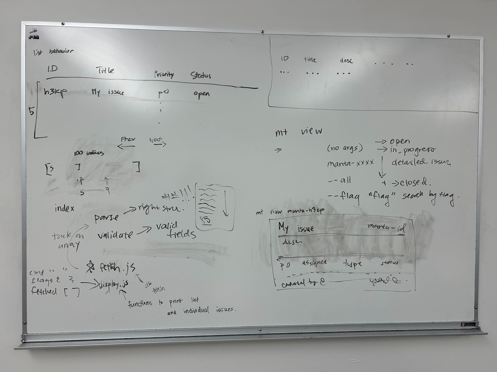
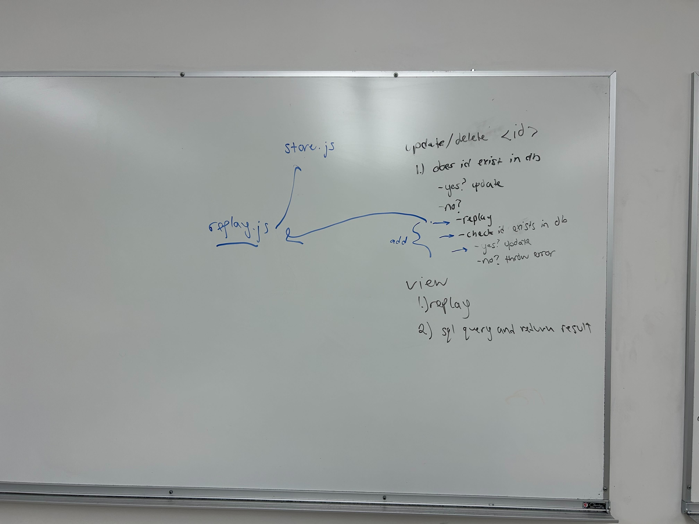

# Sprint 4 Plan

**Sprint Duration:** May 24, 2026 - May 31, 2026

## Sprint Goal

Finalize the command-line interface design, reduce project scope to focus on core functionality, and complete implementation planning for issue viewing and database synchronization.

## Planned Deliverables

* [X] view functionality
* [X] replay functionality 
* [X] where to CD/release
* [X] Versioning
* [ ] testing/CI pipeline

## Related Issues / Deliverables

| Issue / Deliverable    | Owner(s)           | Status  |
| ---------------------- | ------------------ | ------- |
| #123 `mt view`              | Frontend               | Completed |
| #121 `display.js`           | Frontend               | Completed |
| `fetch.js` Integration | Ike               | Completed |
| `replay.js`            | Backend               | Completed |
| #74 Versioning | Ryan               | Completed |
| #75 CD release           | Scott               | Completed |
| #92 use guide           | Frontend               | Completed |
| #129 MVP Final Doc           | Katie, Nat               | Completed |
| Web UI                 | Removed from Scope |         |
| Issue Dependencies     | Removed from Scope |         |

## Risks / Concerns

* Scope remained too large for the remaining project timeline.
* Replay/database synchronization approach was not finalized.
* Multiple implementations for issue viewing still under discussion.

## Post Sprint Notes

view, replay functionality successfully added. halfway through humza added a website, subject to review + change. otherwise development is going very well, continuing to cleanup, document, iterate. CI/testing still in progress, main CI pipeline is set up but key tests are still WIP

## Photos

