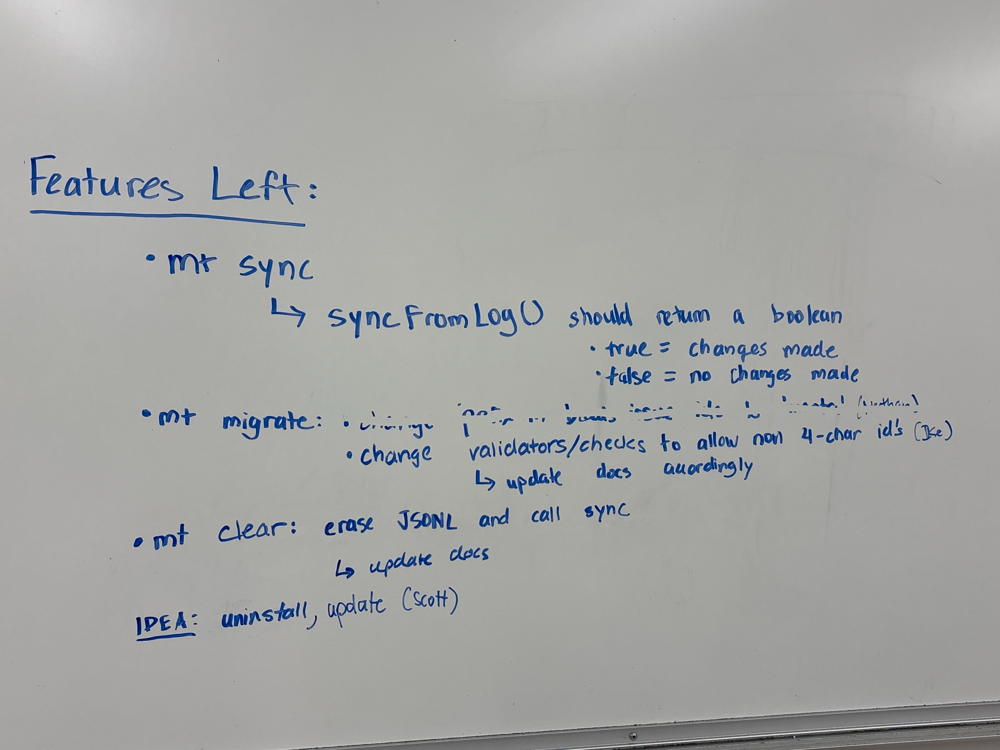

# Sprint 5 Plan

**Sprint Duration:** June 1, 2026 - June 7, 2026

## Sprint Goal

Prepare Manta for code freeze by completing remaining commands, expanding testing coverage, improving documentation, and cleaning up the repository for final delivery.

## Planned Deliverables

* [X] sync
* [X] migrate
* [X] clear
* [X] wiki (replace website)
* [X] repo cleanup

## Related Issues / Deliverables

| Issue / Deliverable | Owner(s)     | Status  |
| ------------------- | ------------ | ------- |
| `mt sync`           | Backend         | Complete |
| `mt migrate`        | Ori          | Complete |
| `mt clear`          | Frontend         | Complete |
| Unit Tests          | Testing Team | Complete |
| E2E Tests           | Testing Team | Complete |
| Wiki Documentation  | Entire Team  | Complete |
| #113 Repository Cleanup  | Angel  | In Progress |
| Website | None | Not Planned (removed) | 

## Risks / Concerns

* Remaining work must be completed before the June 7 code freeze.
* Testing coverage still needed significant expansion.
* Documentation and repository organization required additional cleanup.
* README and website content became inconsistent after recent changes.

## Post Sprint Notes

All remaining commands implemented properly before code freeze, full test suite integrated (200+). Website was scrapped for a wiki hosted directly on github. npm release issues fixed, CI/CD now fully functional. Minor admin notes are being updated. 

## Photos

