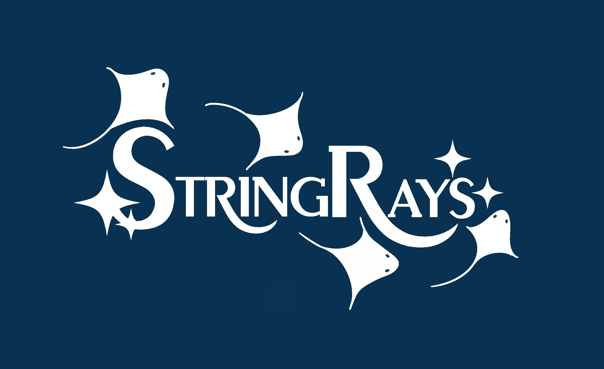

# Team Name: StringRays

## Brand & Identity
**Slogan:** [fill]

**Team Image:**  

**Who we are:**
We are a team of UC San Diego students brought together by a common goal of growing both individually and collectively in the field of software engineering. Recognizing this course as a unique and valuable experience, we strive to make the most of our time by exploring our passions, supporting one another, and building strong skills.

---

## Our Values
- **Communication** - We communicate openly and consistently, keeping each other updated on progress and ideas.
- **Collaboration** – We work together effectively by sharing knowledge, helping teammates, and making decisions as a whole.
- **Accountability** - We take responsibility for our tasks, meeting deadlines and delivering high-quality work.
- **Growth** – We embrace challenges, learn from mistakes, and continuously improve our skills.

<!-- Feel free to add more values -->

---

## Team Roster

### Ori Chason
- **Role:** Project Lead
- **About:**  
  I enjoy programming at the intersection of software and hardware, and currently deepening my skills in compilers construction. Alongside that, I really enjoy project management and working with a team who shares a commnon goal.
- **Favorite Snack:** Potato Chips
- **Favorite Song While Coding:** Narco by Timmy Trumpet
- **GitHub:** https://github.com/orichason

---

### [Name]
- **Role:** [Role]
- **About:**  
  [1–2 sentences about your interests, skills, etc.]
- **Favorite Snack:** [fill]
- **Favorite Song While Coding:** [fill]
- **GitHub:** https://github.com/[username]

---

### [Name]
- **Role:** [Role]
- **About:**  
  [1–2 sentences about your interests, skills, etc.]
- **Favorite Snack:** [fill]
- **Favorite Song While Coding:** [fill]
- **GitHub:** https://github.com/[username]

---

### [Name]
- **Role:** [Role]
- **About:**  
  [1–2 sentences about your interests, skills, etc.]
- **Favorite Snack:** [fill]
- **Favorite Song While Coding:** [fill]
- **GitHub:** https://github.com/[username]

---

### Katie Ngo
- **Role:** Frontend/Design
- **About:** 
I enjoy solving problems and building practical applications like websites that address user needs. I am also interested in developing recommender systems!
- **Favorite Snack:** Choco Churro Turtle Chips
- **Favorite Song While Coding:** Under A Siege by Snow Strippers
- **GitHub:** https://github.com/kttngo

---

### [Name]
- **Role:** [Role]
- **About:**  
  [1–2 sentences about your interests, skills, etc.]
- **Favorite Snack:** [fill]
- **Favorite Song While Coding:** [fill]
- **GitHub:** https://github.com/[username]

---

### Ryan Le
- **Role:** Backend
- **About:**  
  I lowkey like debugging even though it's annoying, and solving problems. I also like dealing with databases.
- **Favorite Snack:** Popcorn
- **Favorite Song While Coding:** anything by Stevie Wonder
- **GitHub:** https://github.com/ryanqgle

---

### [Name]
- **Role:** [Role]
- **About:**  
  [1–2 sentences about your interests, skills, etc.]
- **Favorite Snack:** [fill]
- **Favorite Song While Coding:** [fill]
- **GitHub:** https://github.com/[username]

---

### [Name]
- **Role:** [Role]
- **About:**  
  [1–2 sentences about your interests, skills, etc.]
- **Favorite Snack:** [fill]
- **Favorite Song While Coding:** [fill]
- **GitHub:** https://github.com/[username]

---

### [Name]
- **Role:** [Role]
- **About:**  
  [1–2 sentences about your interests, skills, etc.]
- **Favorite Snack:** [fill]
- **Favorite Song While Coding:** [fill]
- **GitHub:** https://github.com/[username]

---

### TianLin Zhao
- **Role:** Test
- **About:**  
  I love game graphics design and know a fair amount about software and hardware.
- **Favorite Snack:** Seaweed Snips
- **Favorite Song While Coding:** No. I don't listen to music while coding.
- **GitHub:** https://github.com/EveningPiao

---

## Links!
- Project Repo: [link]
- README: [link]
